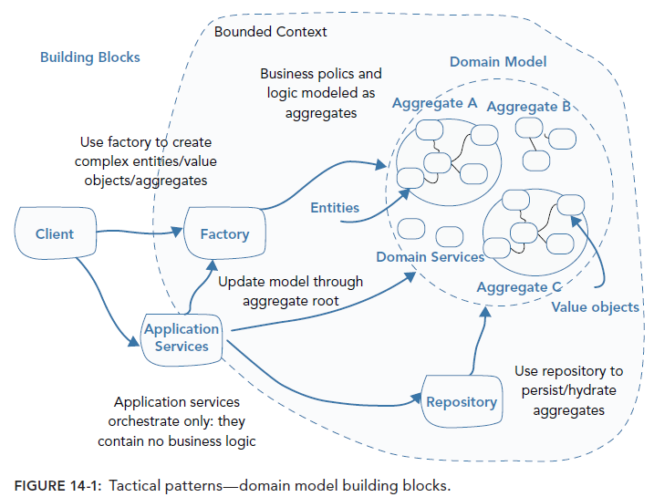

## Building Blocks

Di pertemuan-pertemuan tatap muka sebelumnya, kita sudah membahas strategic patterns dari DDD. Sampai akhir semester, kita akan membahas tactical patterns dari DDD atau dikenal dengan building blocks. Tactical patterns di Buku Scott Millett dimulai dari bab 14.

Building blocks yang dibuat Eric Evans tidak sepenuhnya baru. Anda bisa melihat banyak pattern dari Eric Evans diambil dari buku Martin Fowler berjudul Patterns of Enterprise Application Architecture. Software engineer kerap menyebut buku sakti ini sebagai PoEAA. Martin Fowler membuat rangkuman dari katalog buku ini [disini](https://www.martinfowler.com/eaaCatalog/). Selain PoEAA, banyak juga prinsip yang diambil dari Gang of Four Design Pattern (GoF). Design Pattern dari GoF akan dipelajari semester depan. Walaupun perusahaan Anda tidak sepenuhnya mengimplementasi DDD, Anda tetap dapat mengadopsi cara Eric Evans untuk merancang bagian-bagian codenya.

Eric Evans dan Scott Millett menekankan bahwa pendekatan taktikal kita untuk merancang software akan terus berkembang. Akan ada building block baru. Definisi dari building block yang akan kita bahas juga bisa saja berubah. Yang paling penting adalah kita menjaga Ubiquitous Language agar building block dapat dipahami dengan arti yang sama untuk semua software engineer dalam tim.

Building blocks yang akan kita bahas dari buku Scott Millett adalah:

- [Value Objects](../15_value_objects)
- [Entities](../16_entities)
- [Domain Services](../17_domain_services)
- [Domain Events](../18_domain_events)
- [Aggregates](../19_aggregates)
- [Factories](../20_factories)
- [Repositories](../21_repositories)
- [Event Sourcing](../22_event_sourcing)
